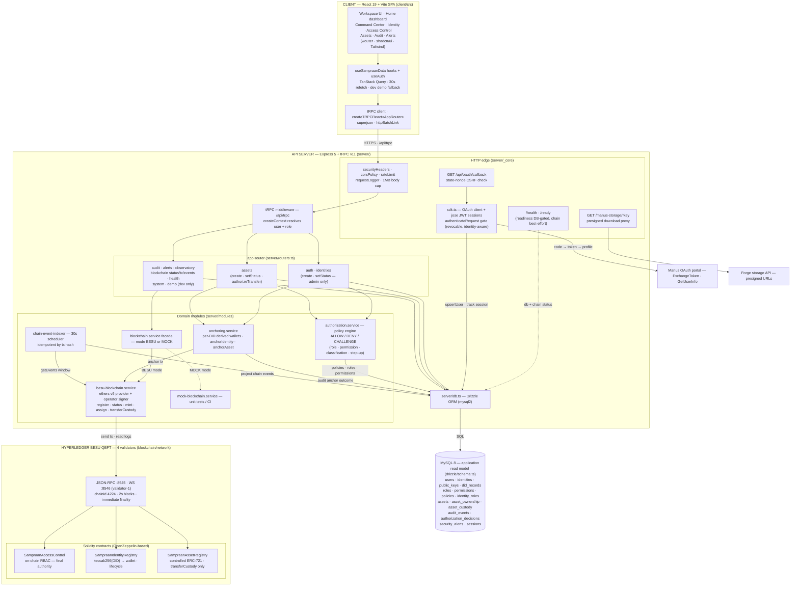
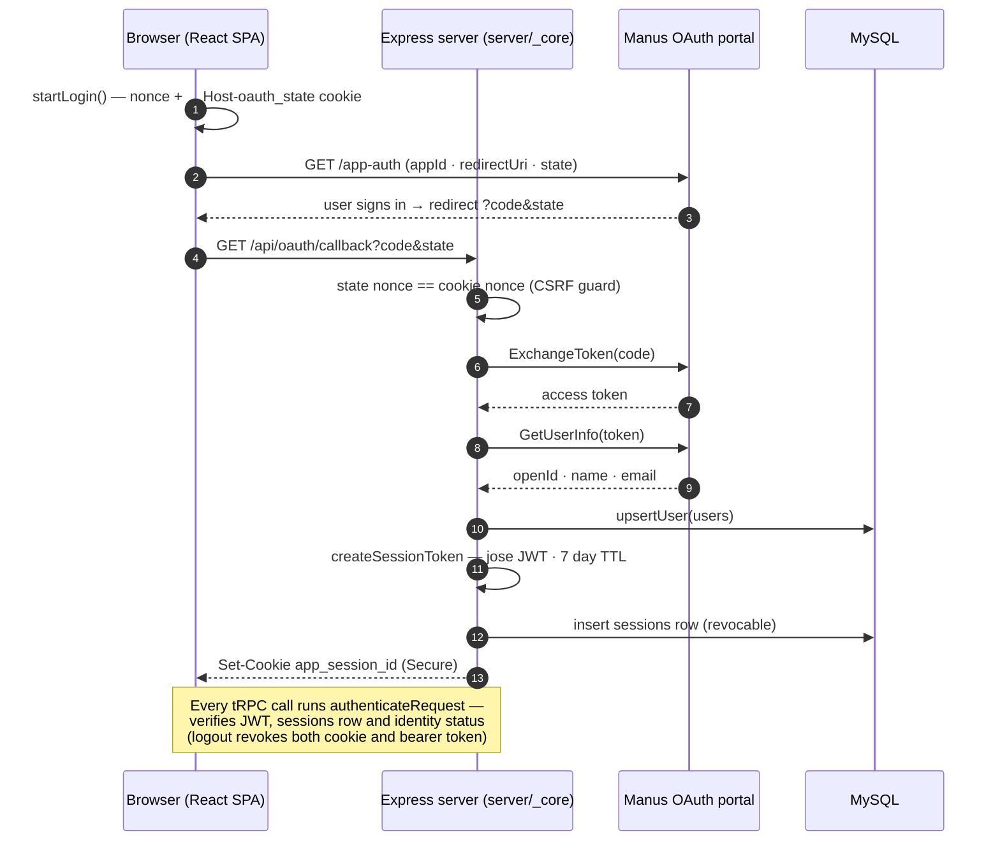
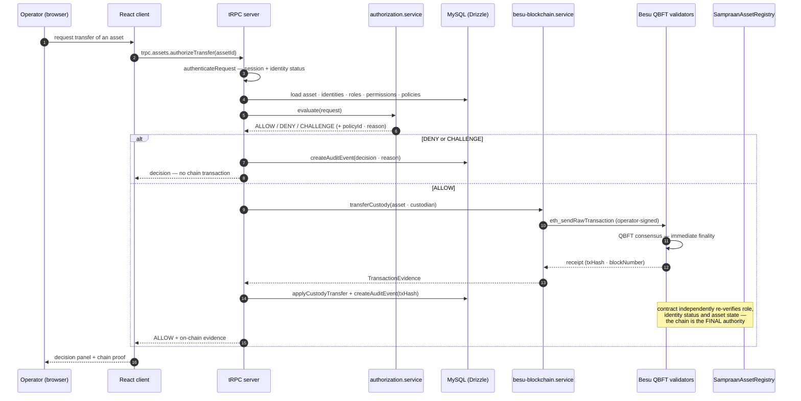
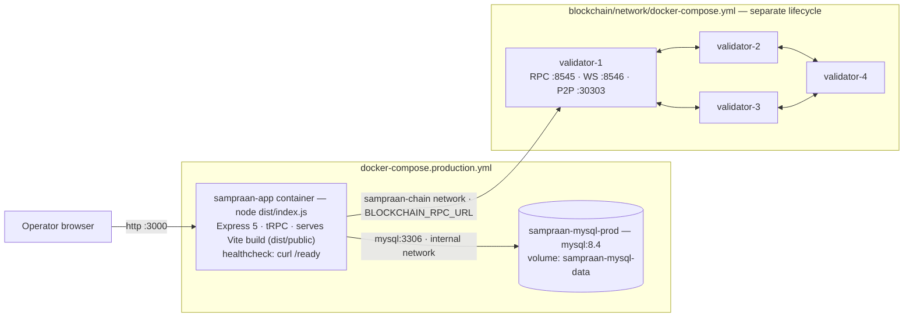

# SAMPRAAN — Architecture Diagrams (Mermaid)

> Generated from the actual codebase: `client/`, `server/`, `drizzle/`,
> `contracts/`, `blockchain/network/`, `docker-compose.production.yml`.
> All diagrams below render with Mermaid v11 (validated in this repo).

---

## 1. System Architecture (main diagram)

---

## 2. Authentication & Session Flow

---

## 3. Asset Transfer Authorization Flow (assets.authorizeTransfer)

---

## 4. Deployment Topology (Docker)

---

### Notes

- **Backend = advisory, chain = final.** The backend policy engine
  (`authorization.service`) decides whether a request *should* be submitted;
  the smart contracts independently re-verify role, identity status and asset
  state on-chain before any state transition.
- **MySQL is the application/read model** — full application data, DID
  documents, audit query projections; the DB is not moved on-chain. Only
  keccak256 digests ever reach the chain (no PII).
- **Anchoring is best-effort** at the creation boundary: a chain outage never
  blocks identity/asset creation, but every anchor attempt (ANCHORED /
  SKIPPED / FAILED) is written to `audit_events`.
- **The chain-event-indexer** runs every 30 s in the API server, projecting
  contract events into `audit_events` (source: `CHAIN_READ_MODEL`), seeded
  from the read model so it stays idempotent across restarts.
- **Blockchain mode**: without `BLOCKCHAIN_RPC_URL` the facade routes to the
  mock service (tests/CI); with it, the real Besu adapter is used.
- **Ops tooling**: `scripts/ops/backup.sh`, `restore.sh`, `rollback-app.sh`
  (MySQL backups, restore, app rollback — see `docs/operations.md`).
